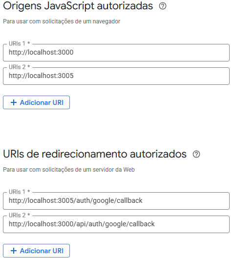

<p align="center">
  <a href="http://nestjs.com/" target="blank"></a>
</p>

# UserHub Backend — API NestJS


API  construída com **NestJS + TypeScript**, autenticação JWT, controle de usuários, permissões, documentação Swagger, logging estruturado ( Slack), CI/CD Render, e arquitetura modular profissional.

## ⚡ Funcionalidades 

### 1. Autenticação de Usuários
- Autenticação JWT com os seguintes endpoints:
  - `POST /auth/signup` — Cadastro de usuário
  - `POST /auth/signin` — Login com email/senha
  - `POST /auth/google/signin` — Login com Google
  - `POST /auth/google/callback` — Callback do Google OAuth
  - `POST /auth/refreshToken` — Refresh token
  - `POST /auth/signout` — Logout
  - `GET /auth/me` — Informações do usuário logado
  - `POST /auth/forgot-password` — Solicitar recuperação de senha (envia e-mail com nova senha)

### Configura es necess rias no Google Console

- No Google Cloud Console, criar um projeto e ativar a API Google Sign-In.
- Em "APIs & Services" > "Dashboard", criar um "OAuth client ID" do tipo "Web application".
- Adicionar a URL do seu projeto, por exemplo: `http://localhost:3005`
- Configurar as variáveis de ambiente no arquivo `.env`:
  ```
  GOOGLE_CLIENT_ID=seu_client_id
  GOOGLE_SECRET=seu_client_secret
  GOOGLE_CALLBACK_USER_URL=api/auth/google/callback
  ```




### 2. Recuperação de Senha
- Fluxo de recuperação seguro via e-mail
- Geração automática de senha temporária
- Template de e-mail responsivo e moderno
- Validação de e-mail e tratamento de erros
- Segurança: Senhas armazenadas com hash usando Argon2

### 3. Gerenciamento e CRUD de Usuários
- Rotas:
  - `GET /users` — Listar usuários (admin)
  - `GET /users/me` — Ver perfil próprio
  - `PATCH /users/:id` — Atualizar
  - `DELETE /users/:id` — Excluir
- Campos: `id` (ULID), `name`, `email` (único), `password` (hash), `role` (`admin`/`user`), `createdAt`, `updatedAt`
- Permissões:
  - **admin**: listar e excluir todos
  - **user**: editar/visualizar apenas o próprio perfil

### 4. Filtros e Ordenação
- Filtro por role: `?role=admin`
- Ordenação: `?sortBy=name&order=asc`

### 5. Notificações de Inativos
- Endpoint para listar usuários sem login há 30 dias

### 6. Logging Estruturado e Auditoria
- Logs em console,  Slack
- Logger configurável: persistência e alerta por Slack
- Exemplo:
```typescript
logger.error('Falha ao salvar usuário', { payload }, { slack: true, userId });
```

### 7. Documentação, Testes e Deploy
- Swagger em `/api/docs`
- Testes com Jest (`yarn test`)
- Docker Compose para ambiente local (Postgres, Redis)
- Deploy automatizado com Render (CI/CD)

### 8. Health Check
O sistema oferece diferentes endpoints de health check:
- **`/health/lb`** - Health check para load balancer (recomendado para Render)
  - Tem restrições de IP além do local (127.0.0.1 e ::1)
  - Tem throttling para IPs externos
  - Retorna um status básico rápido
- **`/health/internal`** - Health check interno (apenas rede interna)
  - Apenas IPs da rede interna (192.168.0.0/16, 10.0.0.0/8)
  - Sem throttling
- **`/health/detailed`** - Health check detalhado
  - Retorna informações completas sobre o sistema
  - Inclui status de serviços dependentes
  - Com throttling para IPs externos

A configuração do Render utiliza o endpoint `/health/lb` com:
- Intervalo: 30 segundos
- Timeout: 10 segundos
- Sem restrições de IP além do local

## 🔐 Segurança
- JWT, roles, validação, tratamento de erros

## 🛠️ Variáveis de Ambiente
- `DATABASE_URL`, `REDIS_URL`, `JWT_SECRET`, `SLACK_WEBHOOK_URL`, etc.

---


O projeto utiliza **ULID** (Universally Unique Lexicographically Sortable Identifier) como identificador único para entidades principais, em substituição ao UUID tradicional. ULIDs são ordenáveis por tempo, seguros para uso distribuído e facilitam queries e ordenação no banco de dados.

**Vantagens do ULID:**
- Ordenação temporal nativa
- Compatível com bancos modernos
- Mais amigável para logs e URLs do que UUID

**Exemplo de uso:**
```typescript
import { ulid } from 'ulid';

const newId = ulid(); // Exemplo: 01HZ7YF8T1X3J6Y2YB4K2K3QZC
```

As migrations e entidades já estão preparadas para trabalhar com ULID como chave primária.


## 📁 Estrutura de Pastas

```
src/
├── modules/        # Módulos de domínio (auth, users, etc.)
│   ├── auth/       # Autenticação e autorização
│   └── users/      # Gerenciamento de usuários
├── common/         # Utilitários, decorators, filtros globais
│   ├── decorators/ # Decorators personalizados
│   ├── filters/    # Filtros de exceção
│   ├── guards/     # Guards de autenticação
│   ├── interceptors/ # Interceptors
│   └── shared/     # Código compartilhado
├── config/         # Configurações centralizadas
├── migrations/     # Migrations do banco de dados
└── main.ts         # Bootstrap da aplicação

test/               # Testes unitários e e2e
```

## ⚙️ Scripts Disponíveis

```bash
# Iniciar em modo desenvolvimento
yarn start:dev

# Build de produção
yarn build

# Iniciar em produção
yarn start:prod

# Lint
yarn lint

# Format
yarn format

# Testes unitários
yarn test

# Testes e2e
yarn test:e2e

# Cobertura de testes
yarn test:cov

# preview template email
 yarn email:dev

```

