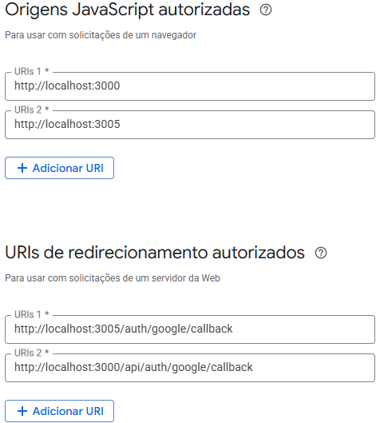

<p align="center">
  <a href="http://nestjs.com/" target="blank"></a>
</p>

# UserHub Backend — API NestJS

## 🧩 Arquitetura Modular — Visão Geral

Este projeto adota uma **arquitetura modular** baseada em princípios explícitos de boundaries, isolamento de domínios e evolução incremental, voltados para escalabilidade, facilidade de manutenção e crescimento sustentável.

### Estrutura Modular

- **Apps (`/apps`)**: Pontos de entrada (bootstraps) que apenas orquestram módulos, sem conter lógica de negócio. Exemplos: `monolith`, `notification`.
- **Packages (`/packages`)**: Cada domínio de negócio (ex: identidade, notificações) é isolado em seu próprio pacote, contendo regras, entidades, controllers, config e testes.
- **Shared (`/shared`)**: Módulos utilitários e infraestrutura compartilhada (ex: autenticação, cache, fila, loggers).

### Princípios Aplicados

- **Boundaries bem definidos**: Cada módulo expõe apenas suas interfaces públicas (ex: via `index.ts`), nunca entidades internas ou implementações privadas.
- **Independência**: Módulos podem ser desenvolvidos, testados e implantados de forma isolada. Comunicação entre módulos acontece por contratos bem definidos (interfaces, DTOs, eventos).
- **Composabilidade**: Apps podem combinar diferentes módulos/packages facilmente. Exemplo: o app `monolith` importa `ContentModule`, `IdentityModule` e outros conforme necessário.
- **Plugabilidade**: Adicionar ou remover domínios é simples — basta importar/remover o package no app correspondente.
- **Testabilidade**: Cada módulo possui seus próprios testes e pode ser testado isoladamente.

#### Exemplo de independência

- O módulo `authorization` em `shared/modules/authorization` exporta apenas seu módulo, serviços, guards, enums e decorators públicos, mantendo entidades e lógica interna encapsuladas.
- Cada módulo pode ser testado e configurado sem dependências diretas de outros domínios.

#### Exemplo de plugabilidade

- Para adicionar um novo domínio, basta criar um novo package e importar no app desejado.
- Para evoluir para microserviços, extraia o package para um serviço dedicado sem reescrita de lógica.

### Vantagens

- **Isolamento**: Cada domínio evolui independente.
- **Escalabilidade**: Fácil crescer para múltiplos apps/microserviços.
- **Organização**: Código limpo, desacoplado e sustentável.
- **Reuso**: Packages podem ser publicados e reutilizados em outros projetos.

---

### 🆕 Mudanças Recentes na Arquitetura

- Refatoração dos boundaries dos módulos para garantir que apenas facades e interfaces públicas sejam exportadas.
- Padronização dos `index.ts` de packages/shared para evitar exposição de entidades e implementações internas.
- Validação de compliance com o guideline modular: apps apenas orquestram, packages concentram a lógica, e shared fornece infraestrutura reutilizável.
- Revisão dos providers e DI para garantir baixo acoplamento e facilitar testes.
- Documentação aprimorada dos contratos de comunicação entre módulos.

---

API construída com **NestJS + TypeScript**, autenticação JWT, controle de usuários, permissões, documentação Swagger, logging estruturado (Slack), CI/CD Render, e arquitetura modular profissional.

## ⚡ Funcionalidades

### 1. Autenticação de Usuários

- Autenticação JWT com os seguintes endpoints:
  - `POST /auth/signup` — Cadastro de usuário
  - `POST /auth/signin` — Login com email/senha
  - `POST /auth/google/signin` — Login com Google
  - `POST /auth/google/callback` — Callback do Google OAuth
  - `POST /auth/refreshToken` — Refresh token
  - `POST /auth/signout` — Logout
  - `GET /auth/me` — Informações do usuário logado
  - `POST /auth/forgot-password` — Solicitar recuperação de senha (envia e-mail com nova senha)

### Configurações necessárias no Google Console

- No Google Cloud Console, criar um projeto e ativar a API Google Sign-In.
- Em "APIs & Services" > "Dashboard", criar um "OAuth client ID" do tipo "Web application".
- Adicionar a URL do seu projeto, por exemplo: `http://localhost:3005`
- Configurar as variáveis de ambiente no arquivo `.env`:
  ```
  GOOGLE_CLIENT_ID=seu_client_id
  GOOGLE_SECRET=seu_client_secret
  GOOGLE_CALLBACK_USER_URL=api/auth/google/callback
  ```



### 2. Recuperação de Senha

- Fluxo de recuperação seguro via e-mail
- Geração automática de senha temporária
- Template de e-mail responsivo e moderno
- Validação de e-mail e tratamento de erros
- Segurança: Senhas armazenadas com hash usando Argon2

### 3. Gerenciamento e CRUD de Usuários

- Rotas:
  - `GET /users` — Listar usuários (admin)
  - `GET /users/me` — Ver perfil próprio
  - `PATCH /users/:id` — Atualizar
  - `DELETE /users/:id` — Excluir
- Campos: `id` (ULID), `name`, `email` (único), `password` (hash), `role` (`admin`/`user`), `createdAt`, `updatedAt`
- Permissões:
  - **admin**: listar e excluir todos
  - **user**: editar/visualizar apenas o próprio perfil

### 4. Filtros e Ordenação

- Filtro por role: `?role=admin`
- Ordenação: `?sortBy=name&order=asc`

### 5. Notificações de Inativos

- Endpoint para listar usuários sem login há 30 dias

### 6. Logging Estruturado e Auditoria

- Logs em console, Slack
- Logger configurável: persistência e alerta por Slack
- Exemplo:

```typescript
logger.error('Falha ao salvar usuário', { payload }, { slack: true, userId });
```

### 7. Documentação, Testes e Deploy

- Swagger em `/api/docs`
- Testes com Jest (`yarn test`)
- Docker Compose para ambiente local (Postgres, Redis)
- Deploy automatizado com Render (CI/CD)

### 8. Health Check

O sistema oferece endpoint de health check:

## 🔐 Segurança

- JWT, roles, validação, tratamento de erros

## 🛠️ Variáveis de Ambiente

- `DATABASE_URL`, `REDIS_URL`, `JWT_SECRET`, `SLACK_WEBHOOK_URL`, etc.

---

O projeto utiliza **ULID** (Universally Unique Lexicographically Sortable Identifier) como identificador único para entidades principais, em substituição ao UUID tradicional. ULIDs são ordenáveis por tempo, seguros para uso distribuído e facilitam queries e ordenação no banco de dados.

**Vantagens do ULID:**

- Ordenação temporal nativa
- Compatível com bancos modernos
- Mais amigável para logs e URLs do que UUID

**Exemplo de uso:**

```typescript
import { ulid } from 'ulid';

const newId = ulid(); // Exemplo: 01HZ7YF8T1X3J6Y2YB4K2K3QZC
```

As migrations e entidades já estão preparadas para trabalhar com ULID como chave primária.

## 📁 Estrutura de Pastas e Conceito Modular

A arquitetura é dividida em **apps** (orquestradores) e **packages** (domínios e infraestrutura):

```
├── apps/                  # Pontos de entrada (APIs, workers, gateways)
│   └── api/               # Exemplo: app principal, apenas importa módulos de packages
│
├── packages/              # Domínios e infraestrutura (plugáveis, reutilizáveis)
│   ├── identity/          # Domínio de identidade (autenticação, usuários, roles)
│   │   ├── core/          # Regras de negócio puras do domínio
│   │   ├── http/          # Controllers, DTOs, validadores e rotas
│   │   ├── persistence/   # Entidades, repositórios, migrations, data source
│   │   └── config/        # Configuração isolada do domínio
│   ├── mail/              # Domínio de e-mail (serviço, templates, envio)
│   └── ...                # Outros domínios (ex: billing, notificações, etc.)
│
├── shared/                # Infraestrutura e utilitários compartilhados
│   ├── modules/           # Módulos de persistência, cache, fila, etc.
│   └── utils/             # Funções utilitárias genéricas
│
├── config/                # Configurações globais (env, redis, database)
├── migrations/            # Migrations globais (se necessário)
├── main.ts                # Bootstrap do app (geralmente em apps/api)
└── test/                  # Testes unitários e e2e
```

### 🧩 **Como funciona o conceito modular?**

- Cada **package** é um "bloco" autocontido: regras, entidades, controllers, config e testes próprios.
- **Apps** apenas orquestram quais módulos/packages serão usados — não possuem lógica de domínio.
- É possível criar novos apps, combinando diferentes packages (ex: API pública, worker de fila, microserviço).
- Packages podem ser extraídos para microserviços no futuro sem reescrita.
- **Plugabilidade:** adicionar/remover domínios é simples, basta importar/remover o package no app.
- **Reuso:** packages podem ser publicados e reutilizados em outros projetos.

> **Resumo:**
>
> - **Isolamento:** cada domínio evolui independente.
> - **Escalabilidade:** fácil crescer para múltiplos apps/microserviços.
> - **Testabilidade:** cada package pode ser testado isoladamente.
> - **Organização:** código limpo, desacoplado e sustentável.

## ⚙️ Scripts Disponíveis

````bash
# Iniciar em modo desenvolvimento
yarn start:dev

yarn start:dev notification

yarn start:dev monolith

# Build de produção
yarn build

# Iniciar em produção
yarn start:prod

# Lint
yarn lint

# Format
yarn format

# Testes unitários
yarn test

# Testes e2e
yarn test:e2e

# Cobertura de testes
yarn test:cov

# preview template email
 yarn email:dev

# Instalação do pacote `uuid`

Instale a dependência no workspace (root) ou apenas no package `identity`:

```bash
# Instalar no workspace root (use -W para confirmar)
yarn add uuid -W
yarn add -D @types/uuid -W

# Instalar somente no package `identity`
yarn workspace identity add uuid
yarn workspace identity add -D @types/uuid
````

Use o `-W` somente quando realmente quiser adicionar a dependência ao root do monorepo.

```

```
